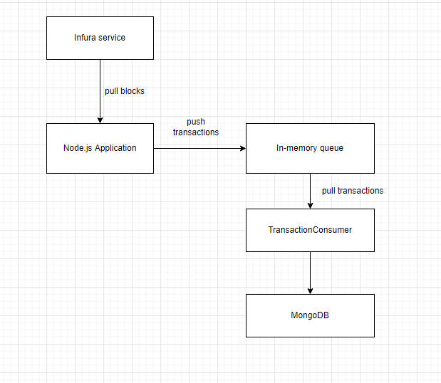

<br>

## Table of contents
- [Requirements](#requirements)
- [Analyze for this task](#analyze-for-this-task)
- [The archiecture of this project](#the-archiecture-of-this-project)
- [Choosing tools](#choosing-tools)
- [Benefits and Drawbacks](#benefits-and-drawbacks)
- [How to deploy this proram](#how-to-deploy-this-program)
- [Some steps to check MongoDB](#some-steps-to-check-mongodb)
- [How to run this proram](#how-to-run-this-proram)


<br>

## Requirements

1. Scan all transactions in Illuvium blockchain game.

2. Save all transactions to a database.


<br>

## Analyze for this task

1. Basic information of ILV token

    - Token name: Illuvium
    - Symbol: ILV
    - Blockchain: Ethereum
    - Token standard: ERC-20
    - Contract: 0x767fe9edc9e0df98e07454847909b5e959d7ca0e
    - Token type: Utility
    - Total supply: 10.000.000 IVL
    - Circulating supply: 7.000.000 IV

2. Some types of transactions

    - Pending transactions: transactions that have just created, and existed on the transaction pool. They are waiting miners or validators push into blocks.

        The getPendingTransactions() method of IlvTokenTransactions class will get all pending transactions.

    - Transactions in blocks.

        From the https://etherscan.io/, I can see the earliest block number is: 12084124, and the current block number is 13878202.
        - Using getPreviousMintedTransactions() method to get all mined transactions from the block number - 12084124 to 13878202.
        - And then using getLatestTransactions() method to get the latest transactions.

    - Internal transactions

        I don't take care this transaction type because these transactions were created by the smart contract, not by human.

3. To scan all transactions in Ethereum blockchain for Illuvium.

    There all some ways to deal with it:
    - get all transactions directly from Ethereum blockchain.
    - use the other services to work on it.

        Now, I will use Infura to pull transactions because Infura supports caching data, so I can read the transactions from Infura fast.

4. The current system have write-intensive property.


<br>

## The archiecture of this project

Below is the architecture of the token-tracker project.




<br>

## Choosing tools

1. Using Infura to get all transactions.

2. Using in-memory queue to contain transactions from Infura, separate the processes between pulling data and saving data to database.

3. Using MongoDB to save all transactions.

    Currently, our system is write-intensive. So using NoSQL is suitable because the underlying architecture of NoSQL is using Write Append Log.


<br>

## Benefits and Drawbacks

1. Benefits

    - Using Infura service to get transactions in blocks from Ethereum blockchain. It will improve the performance of the read operations.

    - Using MongoDB will speed up the write operations.

2. Drawbacks

    - Using in-memory queue can increase the memory size of the server. If the server can be crashed, our data will be lost.

        To reduce this case, we can use Kafka because:
        - speed up write operations by using Zero-Copy.
        - the data will be persistent.
        - it's easy to scale horizontally.

    - Currently, I use free account of Infura. So Infura will limit the requests can access at a second. To increase the number of requests to Infura, we can use premium account.

    - When testing this project, scannng all mined transactions will take a long time.

    - Scanning the pending transactions, the latest transactions, and the mined transactions simultaneously may be impossible. Because the pending transactions are always raised and pushed into stack. It can block the scanning of the other transactions types because Node.js use single thread.

        To solve this problem, we can have two solutions:
        - Using some programming languages that support multithread.
        - Deploy the scanning mined transactions and the rest of the type transactions to different servers.


<br>

## How to deploy this proram

In this task, I will use run MongoDB and Node Application as containers. These will be defined in the docker-compose.yml.

To run these applications, typing the following command at the terminal of this directory path:

```bash
docker-compose up -d --build
```

To remove all images:

```bash
docker-compose down --rmi all
```


<br>

## Some steps to check MongoDB

1. Access to directly MongoDB container.

    ```bash
    docker exec -it token-tracker-mongodb bash
    ```

2. Authenticate with MongoDB shell

    ```bash
    mongo -u token -p "token" localhost/ilv-token
    ```

    Currently, the common information of credentials:
    - username: token
    - password: token
    - database: ilv-token

3. Show all collections.

    ```bash
    show collections
    ```

    The our current collections: **tokentransactions**.

4. Display all rows in MongoDB.

    ```bash
    db.tokentransactions.find()
    ```


<br>

## Wrapping up


<br>

References:

[https://etherscan.io/address/0x767fe9edc9e0df98e07454847909b5e959d7ca0e#code](https://etherscan.io/address/0x767fe9edc9e0df98e07454847909b5e959d7ca0e#code)

[https://etherscan.io/token/0x767fe9edc9e0df98e07454847909b5e959d7ca0e](https://etherscan.io/token/0x767fe9edc9e0df98e07454847909b5e959d7ca0e)